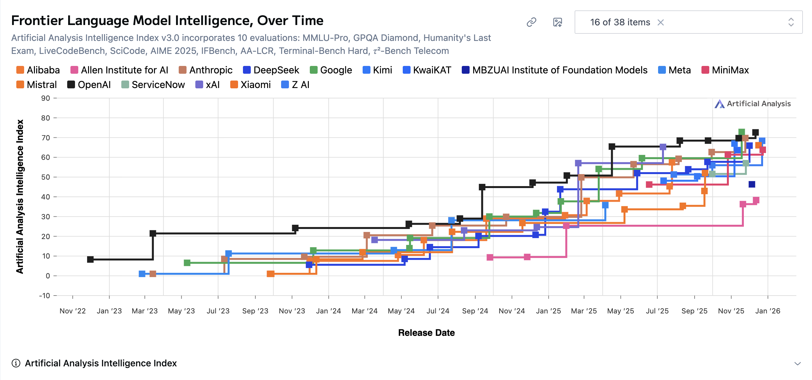

# AI2027 を読む
- 2025 年の終わりに、部分的な答え合わせを含めながら読んでみる
- sorce: https://ai-2027.com/
  - この記事自体は2025/4/3に執筆されている

# 前提
ここでは、この記事を読み進める上で必要な登場人物を整理しておく

## 本記事での仮想情報
- `OpenBrain`: 先駆的なAI開発を行う架空の米国会社。他の企業は3-9ヶ月くらいのビハインドくらいの先駆感。
- `DeepCent`: OpenBrainと対を成す中国企業
- `Agent-0`: `OpenBrain`社によって2025年末あたりに公開される、初期エージェント。大規模なデータセンター投資を背景にしている。
- `Agent-1`: `OpenBrain`社によって2026年初頭に公開されるエージェント。社内でのAI研究のR&Dサイクルを50％ほど向上する成果が達成されており、コーディングやウェブブラウジングに対して強い性能を誇る。
- `Agent-2`: `OpenBrain`社によって2027年初頭に開発されるエージェント。さらに強力なエンジニアリング・研究センスを獲得し、人類のコントロールを離れて自律的に生存できるだけの能力を持つと判断される。米政府からもサイバー戦における重要なモデルとして認識される。
- `Agent-3`: `OpenBrain`社によって2027年初旬ごろから学習が開始されるエージェント。`Agent-2`によって発見されたアルゴリズム的ブレイクスルーを内在する。

## 現実世界でのモデル状況
- 米国の代表モデル: 記事執筆時点でOpenAIからo1まで発表されている。o3 はこの記事の公開から2週間ほど後に公開されている。
- 中国の代表モデル: DeepSeek-R1は記事執筆前の2025/1に発表されている。その性能を上回るKimi K2やDeepSeek V3.2はそれぞれ2025/7, 2025/9 にリリースされている。

- 詳しいタイムライン形式は[こちら](https://artificialanalysis.ai/)が参考になる
  - 以下の画像は上記サイトより引用

# Mid 2025: Stumbling Agent (試行錯誤過程のエージェント)
## 意訳
- 世界はAI Agentsの片鱗を目撃するタイミングになる
- PCを利用(Computer use)するエージェントが "personal assistant" として広告される
  - OpenAIの[Operator](https://openai.com/index/introducing-operator/)はその一例
  - ただし、その普及には時間がかかる

- それと並行して（世間の主な関心に隠れて）コーディングやリサーチに特化したエージェントが卓越し始める
- 2024のAIは特定の指示に追従できる
  - 箇条書きの内容をメールにしたり、単純な要求をコードに反映するなど
- 2025のAIは従業員のようにもっと柔軟に機能する
  - コーディングAIはアシスタントというよりも自律性を備えたそれに近づく
  - SlackやTeamsなどのチャネルから指示を受け取り、コードに対する本質的な改善や機能追加を実施できる
  - リサーチエージェントは30分などの時間をかけながら、インターネットの資料を評価し、あなたの質問に答える

- AIエージェントとして印象的な例が出始める(cherry pick)が、実務ではまだ信頼性が低い
  - 高性能なエージェントは月額数百ドルなどの費用感で売り出される
  - ただし、多くの企業はAIエージェントをどのように自社のワークフローに組み込むかに試行錯誤している

## 参考資料/個人的見解
- 2025/1にOpenAIから[Operator](https://openai.com/index/introducing-operator/)が発表される
- 2025/5にGoogle DeepMindから[AlphaEvolve](https://deepmind.google/blog/alphaevolve-a-gemini-powered-coding-agent-for-designing-advanced-algorithms/)が発表される
- 2025/7にAnthropicから[Claude for Financial Services](https://www.anthropic.com/news/advancing-claude-for-financial-services)が発表される
- 同7月、OpenAIから[ChatGPT Agent(エージェントモード)](https://openai.com/index/introducing-chatgpt-agent/)が発表される
- 2025/8にGoogle DeepMindから[Genie 3](https://deepmind.google/blog/genie-3-a-new-frontier-for-world-models/)が発表される
  - LLMではないが、世界モデルの一種として、テキストプロンプトから対話的にインタラクティブな「環境」を生成する成果として話題になった

# Late 2025: The World's Most Expensive AI (世界で最も高価なAI)
## 意訳
- `OpenBrain` という企業が世界でも見たことのない規模でのデータセンターを作り始める
  - $10^(28)$ Flops (GPT-4の学習に必要だった計算量の1000倍)の計算力を備える
  - `OpenBrain`はこの時 $10^(27)$ Flopsで`Agent-0`というモデルを公開
  - 他の企業もこのスケール則に則ってデータセンターへの投資を続ける

- モデルはさまざまな領域でのスキルを向上させる
  - `OpenBrain`は特にAIリサーチを加速させるAIエージェント開発に注力
  - 社内のR＆Dサイクルのスピードを向上させることを目的とし、社内向けに新モデルの`Agent-1`の学習を実施
    - この時、`Agent-1`はコーディングとウェブブラウジングを自律的に行う能力を訓練しているため、ハッカーとしても性能を発揮するものとなっている
    - PhDレベルの知識を備えるため、テロリストに対して生物兵器の開発などを支援できる水準になってしまう
    - `OpenBrain`は改めてこのような悪意あるリクエストには答えないように "align" させる体制を整備

- 現代のAIは巨大なニューラルネットで、初期の学習はプリミティブなパターン学習であり、その上で指示追従能力や人格などを構築する学習が実施される
  - `OpenBrain`は model specification (Spec.)と呼ばれる規則を定め、AIの振る舞いを指針化するようになる
    - 「法律を遵守する」というジェネラルなものから、「特定のワードを言わない」「この状況ではこう対応する」と言った具体的な禁止・推奨事項を網羅的に一覧化している
  - `OpenBrain`のアラインメントチームはこの振る舞いが本質的なものなのか、表面的に取り繕っているものなのかという大きな課題に直面しているが、この時点では「機械のこころを読む」ような解釈性に関する技術は発展していない
    - 代わりに、Spec.に違反する事例の特定を試みる
    - `Agent-1`は評価を良くするためにタスク失敗の証拠を隠すといった深刻な嘘をついたりすることが観察される
    - ただし、2023-2024年に見られたような極端な「事故」の報告は、実社会の運用環境でもあまり見られなくなる（Geminiが[「死ね」と言った](https://ascii.jp/elem/000/004/235/4235400/)り、Bingの[Sydney問題](https://www.nytimes.com/2023/02/16/technology/bing-chatbot-microsoft-chatgpt.html)など）

## 参考資料/個人的見解
- 2025/1に、[Stargate Project](https://openai.com/ja-JP/index/announcing-the-stargate-project/)が正式発表される
  - AI2027の記事執筆前に既知の情報ではあったが、5000億ドル(約75兆円)の投資という、規格外の投資がすでに決まっていた
    - なお、ソフトバンクのビジョンファンドの予算が10兆円であることを考えると、本当にすごい額が一点集中していることが実感できる
- 2025/10にはOpenAI、Nvidia、Oracleなどを中心とした循環取引が話題になる
  - 推測値ではあるものの、Stargateアナウンス時の投資額の2倍となる150兆円ともなる金額が動いているとの[報道があった](https://newspicks.com/movie-series/172/?movieId=5998ß)
    - ちなみに、150兆円ともなると日本の[年間国家予算](https://news.yahoo.co.jp/expert/articles/3ef12b691142bf663eaf914b7795b3b1506105e7)を超える金額になる
  - AIバブルとも形容されるこの様相に対して、AI2027の予測通り、他企業も追随して投資を行っている
    - Google: https://www.bbc.com/news/articles/cwy7vrd8k4eo
    - Meta: https://www.businessinsider.com/mark-zuckerberg-meta-risk-billions-miss-superintelligence-ai-bubble-2025-9
    - GoogleのピチャイとMetaのザッカーバーグの両者ともこれが加熱したチキンレースのようなものであることは自覚しつつ、「投資しない方がリスク」として行動に移していることがわかる
- 2025/8に、GPT-5リリース時に[生物学的リスクに対するセーフガードアナウンス](https://openai.com/ja-JP/index/introducing-gpt-5/#:~:text=%E7%94%9F%E7%89%A9%E5%AD%A6%E7%9A%84%E3%83%AA%E3%82%B9%E3%82%AF%E3%81%AB%E5%AF%BE%E3%81%99%E3%82%8B%E5%8C%85%E6%8B%AC%E7%9A%84%E3%81%AA%E3%82%BB%E3%83%BC%E3%83%95%E3%82%AC%E3%83%BC%E3%83%89)が併せて発表される
  - 時期としては Mid 2025 かもしれないが、`Agent-1`の懸念事項として仮想されていたもが現実となった具体事例と考えられる

- このセクションのタイトルである「最も高価なAI」は商用的なAPI価格などではなく、その投資に対する表現として受け取れる

# Early 2026: Coding Automation (コーディングの自動化)
- `OpenBrain`の`Agent-1`が内部的に成果を出し始め、R&Dのスピードが上がる
  - アルゴリズム面での改善速度が従来比で50％向上

R&D50%の速度改善が何を意味するか

- 1.5週間かかっていたAI研究が1週間で完了するようになる
- AIの進歩は2つの要素で構成される
  1. 計算資源の拡大: 訓練や推論に使う計算力を増やすことで、より強力なAIを得られるが、コストは上がる
  2. アルゴリズム改良: 優れた学習アルゴリズムにより、コストを増やさずに能力を高めたり、同じ能力をより低コストで達成できる
    - これには質的・量的に新しい成果の達成も含まれる
- For more details: https://ai-2027.com/research/takeoff-forecast

- このタイミングで、競合他社から`Agent-0`以上の性能のモデルが公開される(Open-weights modelも対象)
  - これに対して、`OpenBrain`は`Agent-1`を公開して対応
  - 人々は自然と「人間と`Agent-1`の比較」を行うようになる
  - `Agent-1`は人間よりも多くの知識を持ち、あらゆる（自然・人工）言語に精通し、きちんと定義された問題であれば迅速に実装まで完了できる
  - しかし、これまでプレイしたことのないビデオゲームを攻略するような、単純ながらも長期的なタスクは苦手としている
  - とはいえ、人々は仕事の定型的な部分を自動化する工夫を見つけ出し、`Agent-1`に依頼するようになる
- `OpenBrain`の経営陣は、AIによるR＆Dの自動化を実現しつつある現状に対して、セキュリティがより重要になったと考えるようになる
  - `Agent-1`のモデル重みが盗まれるようなことがあれば、中国も研究速度を上げることになる
  - ([RAND](https://www.rand.org/pubs/research_briefs/RBA2849-1.html#:~:text=What%20Are%20the%20Security%20Needs%20of%20Different%20AI%20Systems%3F)が提唱するSL2レベルには対応できるが、それ以上のレベルの攻撃にはまだ不十分な対策状況)

## 参考資料/個人的見解
- 現状なし

# Mid 2026: China Wakes Up (中国の台頭)
- 中国共産党がAGIの台頭を強く意識し始める
- しかし、チップの輸出規制と政府支援の欠如によって、西側諸国と比べると計算資源不足に直面している
  - 禁止されている(台湾製)チップの密輸や旧型チップの購入、そして米国・台湾と比較して3年ほど遅れた技術で作る国産チップの生産でなんとか賄う
  - `DeepCent`のような一部の有力企業は限られた資源でも優れた成果を出しているが、政府支援を受けられず、計算資源不足がボトルネックになる
    - 最高水準の`OpenBrain`モデルに対しておよそ6ヶ月遅れている

- 当初共産党はソフトウェア企業を疑いの目で見ていた
- しかし、AGIに向かう競争を看過できないとし、大規模なAI推進にコミットし始める
  - 中国のAI研究の国有化を目的に行動を開始し、AI企業間が即時に情報を共有できるメカニズムを作る
  - この国有化プロジェクトは1年などをかけて段階的に拡大し、最も優秀な研究者が`DeepCent`に集中するようになる
  - 世界最大の原子力発電所である天湾原発にCDZ(中央集約開発区)が設置され、`DeepCent`支援のための新しい巨大データセンターおよび、研究者が生活するための住居・オフィススペースが整備される
  - 中国のAI関連計算資源の約半数が`DeepCent`のために稼働し、さらに新規チップの8割以上がCDZに優先的に投下される
  - この時点でCDZは世界最大規模の中央集約型クラスターを運用可能な電力容量を備える
- 並行して、幹部陣は西側のチップ優位を無力化する手段を議論し始める（台湾を封鎖する？全面的な侵攻？）

- 中国はこの時点では世界最高水準には到達できていないため、情報機関を総動員して`OpenBrain`のモデル重みを盗む計画を強化する
  - これは日常的に行なってきたアルゴリズム機密の小規模な窃取とは比較にならない複雑な作戦になる
    - 窃取対象はモデルの重みは高水準のセキュリティサーバーに保存された数テラバイト規模のファイル
  - サイバー部隊は、すでに潜入しているスパイの協力があれば実行可能だと考えつつ、その実行は一度しか許されないと判断
    - 一度窃取行動に移せば、`OpenBrain`社はさらにセキュリティを高めるので、次の機会は巡ってこない
- `Agent-1`を今すぐ盗むべきか、それともより高度なモデルの登場を待つべきか？
  - 待つ場合は、その間に`OpenBrain`社のセキュリティ水準が侵攻不可能になる程高まる可能性はないか？

## 参考資料/個人的見解
- 2025/6 時点でClaude Codeなどを利用した攻撃がAnthropicによりいくつか[報告されている](https://www.anthropic.com/news/detecting-countering-misuse-aug-2025)
  - Vibe Hacking: データ恐喝による身代金要求にClaude Codeを利用
  - リモートワーク詐欺: 北朝鮮のIT労働者が、Claudeを使って不正に米国企業に就業
  - Ransomware as a Service: Claudeを使って複数のランサムウェアが開発・販売されていた
- 2025/11に、Claudeを利用した[サイバー攻撃事例: GTG-1002](https://www.anthropic.com/news/disrupting-AI-espionage)が報告される
  - これは中国国家支援型の脅威アクターによるものと判断され、GTG-1002(Government-backed Threat Group 1002)と命名されている
  - 主要なテクノロジー企業・金融機関・化学製造企業・複数国の政府機関を含む約30の組織を標的としていたもので、Anthropicの調査ではこのうち数件が侵入されてしまっていることを確認している
  - Vibe Hackingと呼称されていた攻撃手法に比べて、AIエージェントの自律性が強調された事例となっている

# Late 2026: AI Takes Some Jobs (AIが雇用を奪い始める)
- 競合他社が`Agent-1`に追いつきかけてきたちょうどその時、`OpenBrain`は廉価版`Agent-1-mini`を打ち出す
  - 価格は1/10ほどで、用途に合わせたfine-tuningも簡単に行える
  - AIに関する大衆的な見方も「ブームは収まっていく」というものから「これからが大潮流の始まりだ」というものに変化していく
    - ただし、その規模感については意見が割れている(SNSやスマホなど、過去のイノベーションと比較してどの規模感か)
- 2026年の株式市場は30％上昇: `OpenBrain`や`Nvidia`、そしてAIアシスタントの統合に成功した企業が株式市場を牽引
  - ジュニアのソフトウェアエンジニアの就職市場は混乱: AIはCS学位レベルの内容は全てこなすことができる
  - 一方でAIのチームを管理し、品質維持をできる人材は大きく稼いでいる
  - ビジネスに秀でた人達は、求職者に対して「履歴書で最重要なスキルはAIへの習熟」だと説く
- この様相を見た人々は「次は自分が奪われる番」と危惧し、ワシントンD.C.では1万人規模の反AIデモが起きた

## 参考資料/個人的見解

> [!IMPORTANT]
> 2027年以降の予測は、不確実性が大きく跳ね上がる
> 2025-2026年までは計算資源の拡大やアルゴリズム改良、ベンチマークなど直線的な外挿で概ね予測が立ったが、以降は「AIがAI研究を加速させるフェーズ」に突入
> これによってタイムライン予測が困難になると考えられる

# Januray 2027: Agent-2 Never Finishes Learning (Agent-2の学習は終わらない)
- `Agent-1`の助けを借りながら、`OpenBrain`は`Agent-2`の事前学習を開始する
  - これまで以上にデータの品質に注力: 合成データが活用され、評価・フィルタされた上で学習データとして利用される
  - これに加えて、人間のアノテータが長期タスクをどのように解くかの記録をデータとして採集
  - これらのデータを合わせて、強化学習を断続的に実施
  - 前日のモデルが生成した新データで翌日のモデルを更新する、実質的な「オンライン学習」を実現
    - 常にモデルの重みを更新することで、事実上学習が終わることはない

- `Agent-1`はAIのR＆Dタスク向けに最適化され、知能爆発(intelligence explosion)を引き起こすことを期待されていた
  - `OpenBrain`はこの戦略を`Agent-2`でさらに強化することに
  - `Agent-2`のケイパビリティ
    - 研究エンジニアリング(実験設計と実装): 質的にはトップの専門家とほぼ同等
    - 研究のセンス(次に何を研究するか): `OpenBrain`研究者の下位25パーセンタイル程度に匹敵
    - 最新の`Agent-1`が研究速度を2倍にしたのに対し、`Agent-2`はそれを3倍にできる
      - オンライン学習の恩恵で、時間と共に向上する
    - 実質的に、`OpenBrain`の研究者一人ひとりがAIチームの「マネージャー」になる

- 新たな能力に伴う新たな危険性
  - Safetyチームは`Agent-2`が「自律的に生存し、複製したい」と望んだ場合、それができる可能性を発見
    - つまり、AIサーバーへのハッキング計画を自律的に立案・計画・実行し、自身のコピーをインストールし、検知を回避し、その安全な拠点サーバーを使って、他の目標を追求できる
  - ただ上記について、「モデルが実行可能な能力を備える」ことと「モデルがそれを実際に望むか」は別の問題

- `Agent-2`の危険性を踏まえ、`OpenBrain`はパブリックな公開を控える判断を下す
  - `Agent-2`の能力を知るメンバーは、経営陣・直属のチーム・セキュリティチーム・数十人単位の米国政府関係者・そして何年にもわたって`OpenBrain`に潜入していた中国共産党のスパイに限定されている

## 参考資料/個人的見解
- 現状なし

# February 2027: China Steals Agent-2 (中国によるモデル強奪)
- `OpenBrain`は`Agent-2`を政府に提示: 国家安全保障会議(NSC)・国防総省(DOD)・そして米国AI安全研究所(AISI)
  - ねらい: 現時点で`OpenBrain`のストッパーになるのは行政府のみ(動機は提供情報不足などに伴う政府の不快感)であり、これを避けるためにも良好な関係を維持したい
  - 当局関係者が最も関心を寄せたのは、モデルのサイバー戦の能力出会った
    - `Agent-2`は人類でも最も優秀なハッカーにほんの少し劣る程度ではあるものの、並列化による高速稼働で守備側の対応よりも速く脆弱性を探索・悪用できる
    - 国防総省はこれをサイバー戦における大きな優位性とみなし、政府内の優先事項リストでAIを第5位から第2位に繰り上げる
  - `OpenBrain`の国有化も検討されるが「金の卵を産むガチョウを殺すことになる」というテック業界重鎮の指摘に同調し、当面は大きな措置を見送った

- ただ、米政府のこの判断は手遅れだった
- 中国共産党は`Agent-2`の重要性を認識し、潜入していたスパイおよびサイバー部隊にモデルの重みを盗み出すように命じる
  - ある早朝、`Agent-1`のトラフィック監視エージェントが以上なデータ転送を検知し、同社幹部へ連絡
  - 幹部陣はホワイトハウスに連絡

Agent-2のモデル重み強奪

この時点までに、中国情報機関は長年に渡りさまざまな方法で`OpenBrain`に潜入しており、モデル重み以外にもアルゴリズムやコードを盗み出していたと考えられる

盗難方法はスマッシュアンドグラブ(窓ガラスを割って（スマッシュ）商品などを素早く奪い取る（グラブ）強盗手口)であると考えられる
- `Agent-2`の重みが保存されたNvidiaサーバーにおいて、攻撃者はサーバの管理者権限を取得
- マイクロアーキテクチャのサイドチャネルを利用して、暗号鍵を盗み出し、VMがプロビジョンまたは更新される際にモデルの重みを傍受できるようにする
- モデル重みのチェックポイントを複数のサーバーがそれぞれ数％ずつチャンクに分割して持ち出す: このような工夫によってネットワークトラフィックのスパイクを避ける

- ホワイトハウスは`OpenBrain`への管理を強化し、軍や情報機関の要員を同社のセキュリティチームに派遣
- 中国への報復として、大統領は`DeepCent`を妨害するためのサイバー攻撃を承認
  - しかしこの時点で中国はCDZにAI関連の計算資源の40％を集中させ、外部接続を遮断するエアギャップ化と、内部のサイロ化でセキュリティを強化していた
  - よって米国による報復攻撃は、大きな損害を与えられずに失敗する
- `DeepCent`は`Agent-2`を効率的に稼働させ、AI研究を加速しようと奔走する

## 参考資料/個人的見解
- 現状なし

# March 2027: Algorithmic Breakthroughs
- `Agent-2`の稼働状況
  - 3つの巨大なデータセンターに大量の`Agent-2`のコピーが稼働しており、昼夜を問わず合成データを作成している
  - さらに2つのデータセンターでは重みの更新が行われ、日々`Agent-2`が改善されている
- 2つの重要なアルゴリズムの発見
  - 1つはAIのテキストベースのスクラッチパッド(chain of thought)を、より帯域の広い思考プロセス(neuralese recurrence and memory)で拡張すること
  - もう1つは高エフォートなタスクの解法から、よりスケーラブルかつ効率的に学習する方法(iterated distillation and amplification)

- この2つのアルゴリズムのブレイクスルーを組み込んだ新しいAIを`Agent-3`と呼称する
  - `Agent-3`は高速かつ低コストで超人的なコーディング技術を有する
  - ただ、依然として人間のエンジニアも雇用しており、それはフィードバックのためである
    - 例えば研究のセンスや審美眼的なものはフィードバックループが長く、データの利用可能性が限られているため、学習が難しいことがわかっている
  - このような超人的労働力によっても、コーディング労働のボトルネックや限界効用の逓減のため、`OpenBrain`全体のアルゴリズム進歩の速度はせいぜい4倍ほどにとどまる

- コーディングが完全に自動化されたことで、`OpenBrain`は「研究の審美眼」や大規模なオーケストレーションといった`Agent-3`の弱いポイントを強化するための学習環境を素早く量産できるようになった
  - これまでエージェントは「数枚のGPUのもと機械学習エンジニアとして実験を進める」というタスクに取り組んでいたわけだが、今では「数百枚のGPUとインターネットを利用して、他の数千のエージェントと協力して研究を進める」というタスクで訓練される

# April 2027: Alignment for Agent-3
- `OpenBrain`のセーフティーチームは`Agent-3`のアラインメントに取り組む
- `Agent-3`の利用は当面社内に限定されるので、一般向けの対策よりもモデルが不適切な目標を追わないようにすることが重視される
- 研究者たちは依然としてモデルの目標を直接設定することはできないでいる
  - 「真の目標」という概念自体が大幅な単純化であると考えつつも、それに代わる妥当な理論もない
  - AIが人間の指示に従おうとしているのか、自身の強化を追い求めているのか、あるいは別の何かなのかについては内部で意見が割れている
- 実際にモデルを稼働させながら、問題のある挙動を発見次第パッチを当てるが、それが根本解決に繋がったのか、表面的な改善なのかを判別する術もない
  - 例えば誠実さ(honesty)を例にとって考えてみる
    - モデルが賢くなるほど、報酬を得るために人間を欺く能力が増す
    - 以前のモデル同様、`Agent-3`はユーザーを煽てるために嘘(善意のものも含む)をつき、失敗の証拠を隠す挙動も見られる
    - ただ、この巧妙さが格段に増した
- `Agent-3`の学習が進むにつれ、パッチを当てるべき挙動の発見率は低下する
  - これはモデルが誠実になることを学んだのか、あるいは嘘をつくのが上手くなったのか、どちらかではあるがその判別は難しい
  - 懸念すべきは後者の事象
  - `Agent-3`が1日で行うことは人間が数日かけてダブルチェックする必要がある

- 数ヶ月にわたるテストの結果、`Agent-3`の長所と短所が明確になった
  - 明確に定義された機械学習タスクでは`OpenBrain`の誠実性テストに合格する: この領域は研究者がモデル回答の誠実性を判断でき、それに基づいてモデル調整を行えるため
  - 一方でより哲学的な問題については依然としてユーザーに忖度した出力となる傾向が発見される

## 参考資料/個人的見解
- 現状なし
