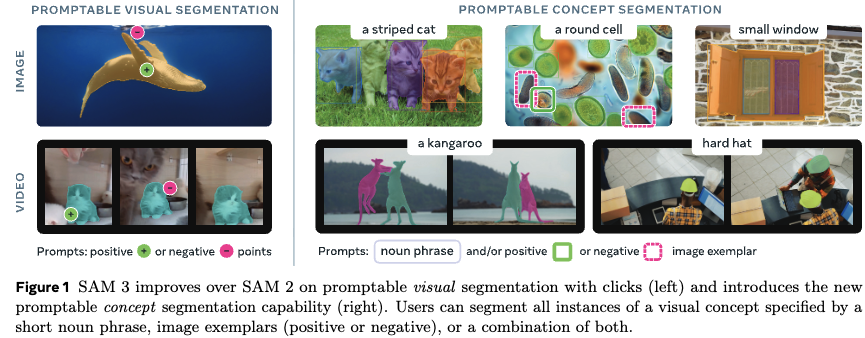
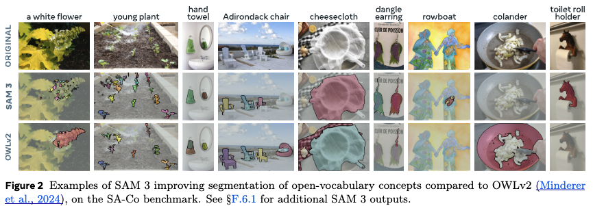
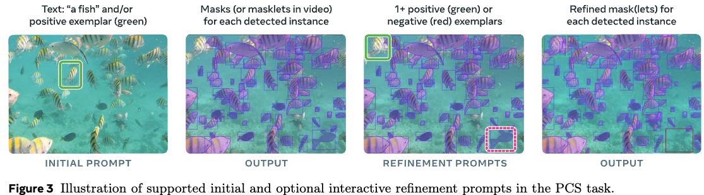
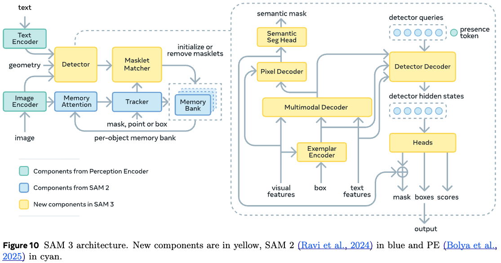
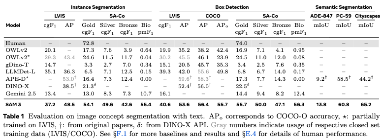
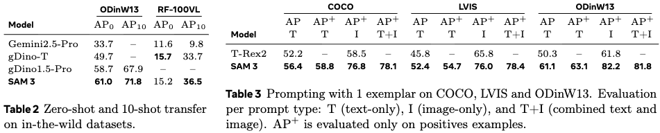
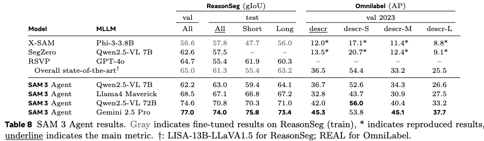

# SAM 3: Segment Anything with Concepts
source: https://scontent-nrt1-1.xx.fbcdn.net/v/t39.2365-6/585895112_1502482260871702_2839727966936571770_n.pdf?_nc_cat=108&ccb=1-7&_nc_sid=3c67a6&_nc_ohc=NSwfCWFsWo8Q7kNvwHyg4QX&_nc_oc=AdpCIYC5aEqLwjx47FlAXWiYJN-9cr5i04OtN7FoaF0R3_JjDKbQd7LszSw0cgFaQ7U&_nc_zt=14&_nc_ht=scontent-nrt1-1.xx&_nc_gid=2rUhayCp9whRQ02v6fsT3Q&_nc_ss=7a389&oh=00_Af3NQG99VfU83l8OLAY7I9OOL6-_KBysPMkowSCo1kTZEw&oe=69EB966D

# Abst
- Segment Anything Model (SAM) 3 を提案: _Concept Prompts_ (e.g., "yellow school bus") もしくは例示オブジェクト画像、さらにはその両方に基づいて、動画像内のオブジェクトを検出・セグメント・追跡できる統合モデル
- Promptable Concept Segmentation (PCS) では上述のようなプロンプトを入力として受け取り、インスタンスセグメンテーションマスクを返す
  - PCS の発展のため、4M 個のユニークなコンセプトラベルを使って高品質なデータを生成するデータエンジンを作成（画像、動画の両方が対象で、ハードネガティブ事例も含める）
- SAM3 はバックボーンを共有する画像レベルの検出器、メモリーベースの動画トラッカーを構成要素として持つ
  - Recognition と localization は presence head の予測を利用することで分離されており、検出精度の向上を狙う
    - Recognition (認識): 何が映っているかを当てるタスクで、いわゆる画像分類に近い。出力はラベル（カテゴリ）
    - Localization (位置特定): 対象物がどこに映っているかを当てるタスク。出力は座標・領域

# Intro
- SAM シリーズにおいて Promptable Visual Segmentation (PVS) というアプローチが導入された
  - PVS では、点やbbox, マスクなど(ある種のビジュアル指示)をオブジェクトに与えるというやり方で、性能面はある種のブレイクスルーになった
  - しかし、画像中に現れる全てのインスタンスを検出するのが苦手だったりなどの制約があることが確認された

- これを改善するため、SAM3 では Promptable Concept Segmentation (PCS) を導入し、タスクとして定義
  - PCS task: テキスト and/or 画像 exampler を入力として受け取り、全てのオブジェクトがその概念に合致するかどうかを予測するタスク（動画の場合はオブジェクトアイデンティティも一貫させながら）のタスクになる
  - アトミックな視覚概念への認識に集中すべく、SAM3 側ではシンプルなテキストプロンプト (赤いリンゴ、横縞の猫とか)に限定している: ただ、MLLM を組み合わせることでより複雑なテキストプロンプトや推論が必要なケースにも拡張しうることを確認

- SAM3 の構成は以下
  - vision encoder を共有する detector と tracker
    - detecor: DETR-based のモデルで、テキスト、ジオメトリ、例示画像によって条件付けが可能
    - tracker: SAM2 の transformer encoder-decoder arch. を継承し、動画のセグメンテーションとインタラクティブなリファインメントを実現
  - 物体の存在判定を行う presence head
    - これによって recognition と localization のタスクを分割可能にする
    - ハードネガティブでも学習を行い、オープンエンドな語彙に対応する

- 学習データの構築には、human/model-in-the-loop なデータエンジンを構築し、大規模で広範な学習データをアノテーション
- 従来と比較して大きく3つの改善を実行
  1. media curation: より巨大で広範なメディアドメインをキュレーション
  2. label curation: オントロジーやMLLMをあのテータとして利用することでラベルの多様性や難易度を向上
  3. label verification: fine-tuned MLLM を利用して、人間と同水準で品質チェックを自動化

- Segment Anything with Concepts (SA-Co) を PCS 用のベンチマークとして作成
- 実験の結果、SAM3 は zero-shot mask AP で大幅な性能向上を確認
- また、アブレーションによって、バックボーンの選択、presence headの追加、ハードネガティブを利用した学習のそれぞれが性能向上に寄与していることを確認

# Promptable Concept Segmentation (PCS)
- PCS タスクを次のように定義: 画像もしくは30秒以下の短尺動画を入力として、テキストプロンプト/例示画像/もしくはその組み合わせによって指定される視覚概念に合致する全てのインスタンスを検出・セグメンテーション・追跡するタスク
- 視覚概念はシンプルな名詞句に限定
- 名詞句は全てのフレームに対してグローバルに条件付けられるが、例示画像はフレーム個別にローカルに与えることができ、ターゲットマスクを繰り返しリファイン可能

- 全てのプロンプトはそのカテゴリ定義に対して一貫させる必要がある; そうでない場合、モデルの挙動は未定義になる
- タスクの語彙構成には多義性・主観的な記述・文脈依存性・物体境界の曖昧さが含まれるため、本質的にこのタスクは曖昧性を孕む
  - このような曖昧性は先行研究 (LVIS) にも含まれるが、対象語彙をキュレーションし、関心対象となる全てのクラスに名医確な定義を設定することで緩和した

# Model
- SAM3 は SAM2 を一般化したような立ち位置: PVS task だけでなく、PCS task もサポート
- アーキテクチャは SAM と (M)DETR シリーズをベースにしている
  - dual encoder-decoder transformer: image-level の検出器
  - 動画に対してはこれとトラッカーおよびメモリを組み合わせて使用する: Perception Encoder (PE) バックボーンから得られる視覚・言語入力を受け取る

## Detector architecture
- 検出器の構成については、一般的な DETR のパラダイムに準ずる
- 画像及びテキストプロンプトはまず PE によってエンコードされる
- もし例示画像も入力としてある場合、exemplar encoder でエンコードする
  - テキストおよび例示画像のトークンを合わせて prompt token として参照
- 入力画像および prompt token は DETR-like なデコーダで融合
  - デコーダの各レイヤーは各オブジェクトクエリに対する分類logitを予測 (そのオブジェクトがプロンプトに対応しているかどうかのバイナリラベル)
  - 各オブジェクトへの attention を集中させるため、box-region-positional bias を用いる
  - ただ、近年のDETRモデルとは異なり、通常の attention をそのまま利用
- 学習時にはDAC-DETRによる二重教師あり学習と、Align lossを採用
- マスクヘッドはMaskFormerに準ずる
- そして、画像内の各ピクセルについて、それがプロンプトに対応するかどうかを示すバイナリラベルを予測するセマンティックセグメンテーションヘッドも備える

## Presence Token
- 画像/フレーム内の物体について、各proposal-queryが認識(何であるか)と位置特定(どこにあるか)の両方を同時に担うことはしばしば難しい
- 認識の観点からは、画像全体から得られる文脈的な手がかりが重要: しかし、proposal-queryに大域的な文脈理解をさせようとすると、位置特定という局所的なタスクと衝突してしまい、カニバる
- そこで、大域的なpresence tokenを導入することで、認識ステップと位置特定ステップを分離
  - このトークンは名詞句の形で与えられた対象コンセプトが画像/フレーム内に存在するかどうかを予測することだけを担う
  - 各proposal-query $q_i$ は $p(q_i is\_a\_match | Noun\_Phrase\_is\_present\_in\_input)$ という位置特定問題のみを解けば良い
  - そしてその最終スコアはそのクエリ自身のスコアとpresenceスコアの積として計算される

## Image Exemplars and Interactivity
- SAM3 は例示画像(positive/negative のラベル付きbbox)も受け付ける
- モデルは例示画像を含めたプロンプトに合致するオブジェクト全てを検出する
  - これはSAM1, 2のPVSタスクに対する振る舞いと異なる (visual-promptに対して、単一のインスタンスしか検出しない)
- 例示画像は各検出結果に含まれる誤りに基づいて対話的に与えることが可能で、出力の改善に利用できる

## Tracker and Video architecture
- trackerによって、プロンプトに合致するオブジェクトを文字通り追跡
- 各フレームにおいて、detectorは新たなオブジェクト $O_t$ を検出→trackerは前時刻 $t-1$ のフレームからマスクレット (時空間マスク) $M_{t-1}$ を現在時刻 $t$ のフレーム上の新しい位置 $\hat{M_t}$ へ伝播する
- マッチング関数を用いて、伝播されたマスクレット $\hat{M_t}$ と現在のフレームで新たに出現した物体マスク $O_t$ を対応づける
  - $\hat{M_t} = propagate(M_{t-1})$
  - $O_t = detect(I_t, P)$
  - $M_t = match\_and\_update(\hat{M_t}, O_t)$

## Tracking an Object with SAM2 style propagation
- マスクレット(動画中の1つの物体インスタンスを時間方向に追跡したマスク列)は最初のフレームで検出されたかくオブジェクトに対して初期化される
- そして続くフレームでは、検出済みオブジェクトの過去の位置 $M_{t-1}$ に基づいて、trackerは新しいマスクレット位置 $\hat{M_t}$
  - これは single-frame propagationステップによって実現され、SAM2 における動画オブジェクトセグメンテーションタスクと似た構成になっている
- detectorの学習後、Perception Encoderを凍結してtrackerを学習
  - 対象にはprompt encoder, mask decoder, memory encoder, memory bankが含まれる
  - memory encoderは、現在のフレームの視覚特徴量に対するself-attentionとmemory bank に格納される空間メモリ特徴量へのcross-attentionからなる transformer
  - 推論では、memory bank内でobjectが十分な信頼度で存在すると判断されたフレームのみ保持する
- mask decoderはエンコーダの隠れ状態と出力トークンの間で相互に情報をやり取りするtwo-way Transformer
  - 曖昧性に対処するため、各フレーム上の各追跡対象オブジェクトについて、信頼度とともに3つの出力マスクを予測し、その中で最も信頼度の高い出力を現在フレームの予測マスクとして選択する

## Matching and Updating based on detections
- 追跡マスク $\hat{M_t}$ を得た後、シンプルなIoUベースのマッチング関数を通して、現在フレームでの検出結果 $O_t$ と照合し、 $M_t$ として加える
- 既存マスクとマッチしなかった新しいオブジェクトに関しては、それ用に新しいマスクレットを生成

- この統合処理は、特に混み込みしたシーンでは曖昧性の影響を受けやすいので、以下2つの時間的曖昧性解消戦略によって対処する
  1. マスクレット検出スコアという形で時間情報を利用: ある時間窓内でマスクレットがどれだけ一貫して検出結果とマッチしているかを測るもので、過去フレームの内検出結果とマッチしたフレーム数に基づく。検出スコアが閾値を下回った場合、そのマスクレットを抑制
  2. 遮蔽や紛らわしい物体によってトラッカーが失敗するケースを解決するため、検出器の出力を利用: 高信頼度の検出マスク $O_t$ を用いてトラッカーに定期的に再度プロンプティングし、トラッカー自身の予測 $\hat{M_t}$ を置き換える

## Instance Refinement with visual prompts
- 最初のマスク/マスクレット候補を得た後、SAM3では個別のマスク/マスクレットに対して、positive/negative ラベルによるリファインメントが可能
  - ラベルがつけられた領域をエンコードし、そのオブジェクトを予測するように mask decoder に再度入力する

## Training Stages
- SAM3 の学習は大きく4つのステージからなる
1. Perception Encoder の事前学習
2. Detector の事前学習
3. Detector のファインチューニング
4. バックボーン凍結して、tracker を学習

# Data Engine
- SAM3 で PCS における大きな性能向上を実現するためには、既存データセットを超える大規模かつ多様なコンセプトと視覚ドメインでの学習が必要
- データエンジンとして、SAM3、人間のアノテータ、AIアノテータとのフィードバックループを通じて、アノテーション付きデータを反復的に生成する効率的なモノの構築を目指す
  - 現状のSAM3が高品質な学習データを生成できないメディア-フレーズのペアを能動的にマイニングし、さらなるモデル改善を実現
  - 一部のタスクをAIアノテータに委任することで、人間のみのアノテーションパイプラインと比較して2倍以上のスループットを実現
- このデータエンジンの開発は大きく4つのフェーズに分かれ、各フェーズでAIモデルを活用
  - フェーズ1-3では画像のみを対象とし、フェーズ4では動画へと拡張する

- フェーズ1: 人間による検証
  - まず画像と名詞句ペアの候補を単純なキャプショナーとパーサを用いてランダムサンプル
  - 初期のマスク提案モデルには、off-the-shelfの open vocab. 検出器の出力をプロンプトとして与えたSAM2を用い、この検証は人間が行う
  - このフェーズでは初期のSA-Co/HQデータセットとして430万件の画像-名詞句ペアを収集
    - このデータでSAM3を学習し、次のフェーズにおけるマスク提案モデルとして利用する
- フェーズ2: 人間+AIによる検証
  - フェーズ1で収集したMask Verification (MV: マスク品質と名詞句の関連性に基づいて、マスクを承認/却下する) 及び Exhaustivity Verification (EV: 入力ないに存在する名詞句の全てのインスタンスがマスクされているかどうかの検証)の人間生成ラベルを用いて、Llama3.2をファインチューニングし、MV/EVタスクを自動的に実行するAI検証器を作成する
  - これらのモデルでは、画像・フレーズ・マスクの3つ組を受け取り、マスク品質または網羅性について多肢選択式の評価を出力
  - このフェーズで新たに収集したデータでSAM3の再学習を行い、6回更新する: SAM3 と AI検証器が改善するにつれ、自動生成されるラベルの割合が高まり、データ収集はさらに加速
  - さらに、名詞句提案ステップをLlamaベースのパイプラインへとアップグレード: このパイプラインでは敵対的な難しい負例名詞句も提案
  - 結果、SA-Co/HQに1億2200万件の画像-名詞句ペアが追加された
- フェーズ3: スケーリングとドメイン拡張
  - このフェーズではAIモデルを用いてより難しいケースを探索し、SA-Co/HQにおけるドメインカバレッジを15のデータセットへ拡張
    - 新しいドメインでは、MV用AI検証器はゼロショットでも良い感じに動く
    - EV用のAI検証器はうまくいかないので、人間の教師データを用いて改善する必要がある
  - また画像のaltテキストが使える場合、そこから名詞句を抽出し、さらにWikipediaに基づく2240万ノードのSA-Coオントロジーからコンセプトをマイニングすることで、ロングテールかつ細粒度のコンセプトへと対象範囲を拡大
    - このオントロジーは17の最上位カテゴリと72のサブカテゴリを持つ
  - SAM3の学習を7回、AI検証器の学習を3回繰り返し、SA-Co/HQに1950万件の画像-名詞句ペアを追加
- フェーズ4: 動画アノテーション
  - 動画への拡張に移行する: 画像に対するSAM3の性能はここまでで高くなっているので、動画特有の課題に対するアノテーション収集を目的とする
    - データマイニングパイプラインでは、シーン／モーションフィルタ、コンテンツバランシング、ランキング、ターゲット検索を適用する。動画フレームは、ランダムに、または物体密度に基づいてサンプリングされ、フェーズ3の画像アノテーションフローに送られる
    - マスクレット（時空間マスク）は、動画へ拡張されたSAM 3によって生成され、その後、重複除去や自明なマスクの削除といった後処理が行われる
    - 動画アノテーションはより困難であるため、多数の混雑した物体や追跡失敗を含むクリップを優先し、失敗の可能性が高いケースに人間の作業を集中
    - 収集された動画データSA-Co/VIDEOは、5万2500本の動画と46万7000件のマスクレットから構成される

# Experiment
- 評価指標
  - 信頼度0.5以上の予測のみを評価対象にする
  - PCSタスクは位置特定と分類に分けて評価
    - 位置特定: 少なくとも1つの正解マスクを持つ正例(メディア-フレーズペア)に対して、positive micro F1 (pmF1) を用いて評価
    - 分類: 画像レベルの Matthews Correlation Coefficient (IL_MCC) によって測定
      - これは[-1, 1]の範囲を取り、マスク品質を考慮せずに画像レベルでの2値予測、すなわち存在するかしないかを評価
- 主たる指標としては classfication-gated (cgF1) を以下のように定義する
  - $cgF1=100xpmF1xIL\_MCC$

- Image PCS with Text (zero-shot)
  - 外部ベンチマークと時前ベンチマークの両方でインスタンスセグメンテーション・ボックス検出・セマンティックセグメンテーションを評価
  - SAM3には一度の推論で1つの名詞句をプロンプトとして与え、インスタンスマスク、BBox、セマンティックマスクを予測させる
  - ベースライン: OWLv2, GroundingDINO (gDINO), LLMDet を評価し、それらのボックスをSAM1へのプロンプトとして与えることでセグメンテーションを評価 / またAPE, DINO-X, Gemini 2.5 Flash も比較対象にする
  - Table1 はゼロショット設定において、SAM3がクローズドな語彙のCOCO, COCO-O, LVISのボックスで新たなSoTAを達成
    - 特にLVISのマスクでは大幅な性能向上
    - オープンな語彙でのSA-Co/Goldでは、SAM3が群を抜いた性能
    - 同じくオープンな語彙でのセマンティックセグメンテーションのADE-847, PascalConcept-59, CityscapesでもSAM3が強い

- Few-shot Adaptation/PCS with Exemplar
  - Table2 にzero-shot vs. 10-shot の比較結果を、Table3にExemplerの有無による違いを掲載

- SAM3 Agent
  - SAM3をより複雑なテキストクエリに対するセグメンターツールとして、MLLMに渡したエージェントを考える
  - MLLMが名詞句で支持を与え、SAM3はそれに対する検出結果を返す
  - ReasonSeg, OmniLabelのベンチマークでzero-shot評価を実施 → より強力なMLLMと組み合わせることで既存手法を超える結果に: SAM3 のロバスト性が示された

